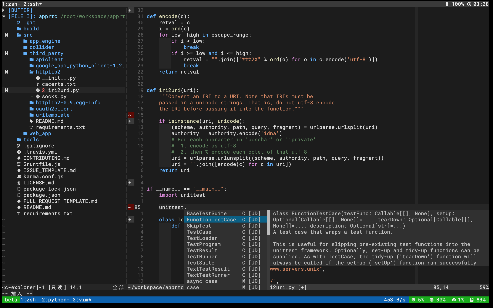

# .dotfile

One dotfile to rule them all.



Featured:
* oh-my-zsh
* coc.nvim
* many other vim plugins
* docker-clean
* many tmux plugins to display server status
* handy git configurations
* keep updated with git & git submodule


## Install

### pre-req

* git >= 2.22
* tmux >= 3.0a
* vim >= 8
* nodejs
* [nerd fonts](https://github.com/ryanoasis/nerd-fonts) installed in your terminal simulator

for python dev:

* isort >= 5.0.0
* black
* pylint

### init

``` shell
cd
git clone https://github.com/bojiang/.dotfile.git
cd .dotfile
./init.sh
./update.sh
```

done
